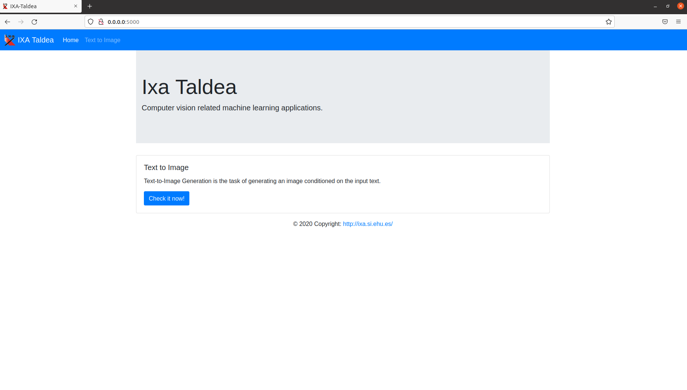
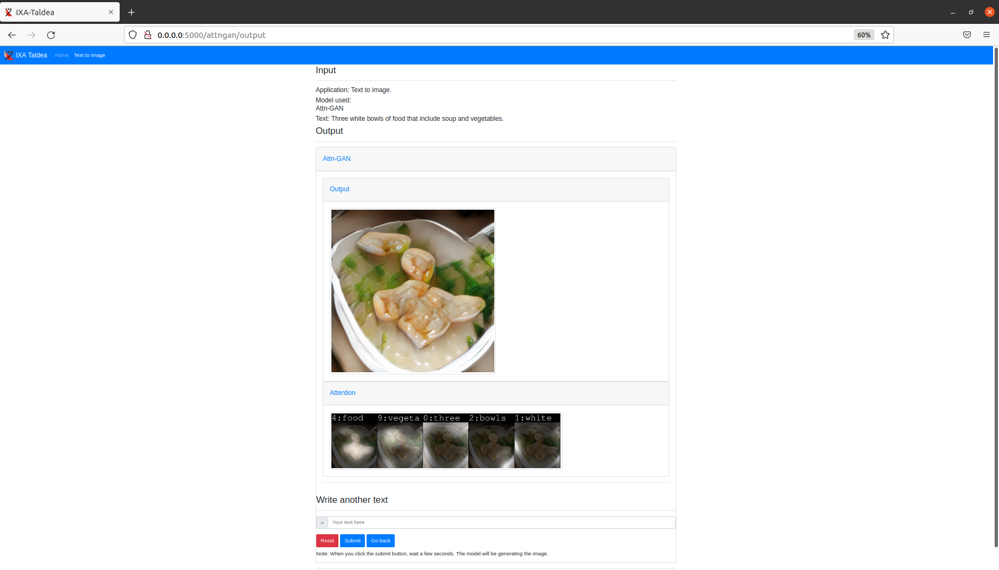

# text2imageApp

## About the proyect

This project has been created in order to generate images from a given text as input. The models used are Attn-GAN and DM-GAN.  The citation to the papers is included at the end.

## Images

Homepage

Text to image app (the same interface in each section)

Output

Compare section's output

## Dependencies

Python 2.7
Pytorch

In addition, please install the following packages:

> pip install python-dateutil==2.8.1

> pip install easydict==1.9

> pip install pandas==0.24.2

> pip install torchfile==0.1.0

> pip install scikit-image==0.14.2

> pip install flask==1.1.2

> pip install nltk==3.5

> pip install scipy==1.4.1

> pip install Keras==2.3.1

> pip install tensorflow==2.2.0

> pip install Pillow==7.2.0

> pip install matplotlib==3.3.2

> pip install scikit-learn==0.23.1

> pip install numpy==1.19.0

> pip install torch==1.5.1

> pip install torchvision==0.6.1

> pip install torchtext==0.6.0

> pip install tabulate==0.8.7

> pip install spacy==2.3.2

> pip install imageio==2.9.0

## How to run it

First of all, you have to include in the DM-GAN folder all the files purchased in [this link](https://drive.google.com/file/d/1zeM9KylFjF7poufONXpTBV13DL0svLjp/view?usp=sharing).

Now, follow this steps:

1. Open the terminal inside the main folder.
2. Execute the python program 'predictor_app' (python predictor_app.py).
3. Go to any navigator and search the localhost and the port. By default, '0.0.0.0:5000'.
4. When fnishing, stop the process.

## Examples of the models

Text        |  Attn-GAN example              |  DM-GAN example
-----------:|:------------------------------:|:-------------:
Several people are on a busy street with lots of animals.  |    |  
People are gathered to see the blue jet plane on display.  |    |  
People shopping for interactive video games at Best Buy.  |    |  
  
## Reference

 - [AttnGAN: Fine-Grained Text to Image Generation with Attentional Generative Adversarial Networks](https://arxiv.org/abs/1711.10485).
 - [DM-GAN: Dynamic Memory Generative Adversarial Networks for Text-to-Image Synthesis](https://arxiv.org/abs/1904.01310).
